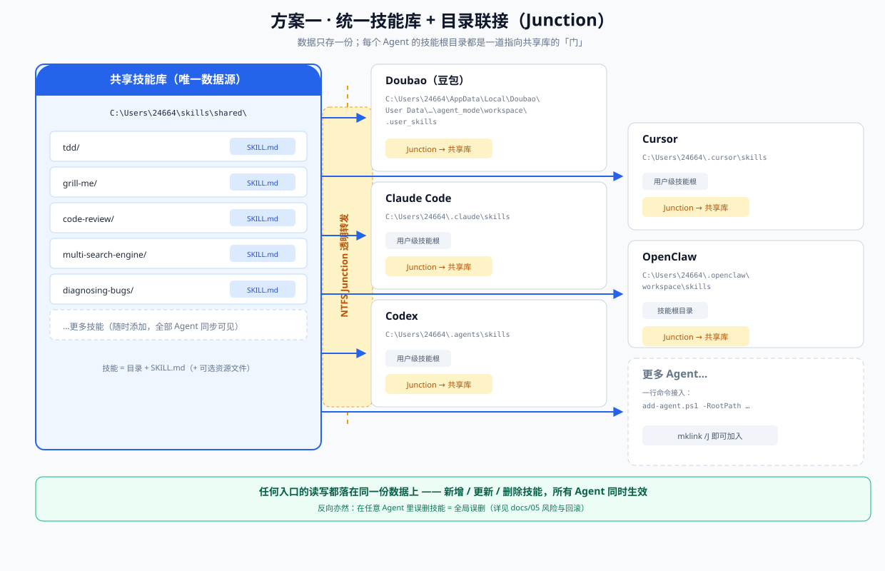
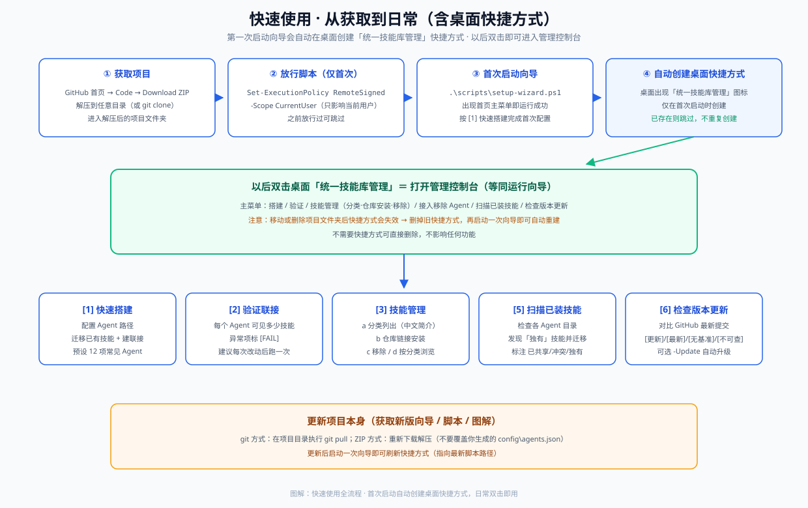
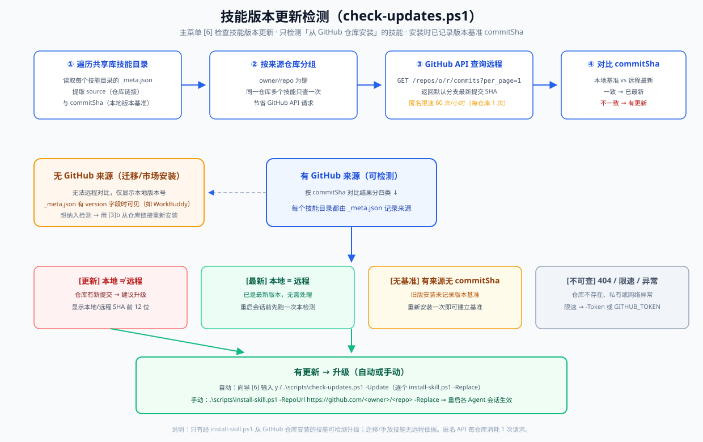
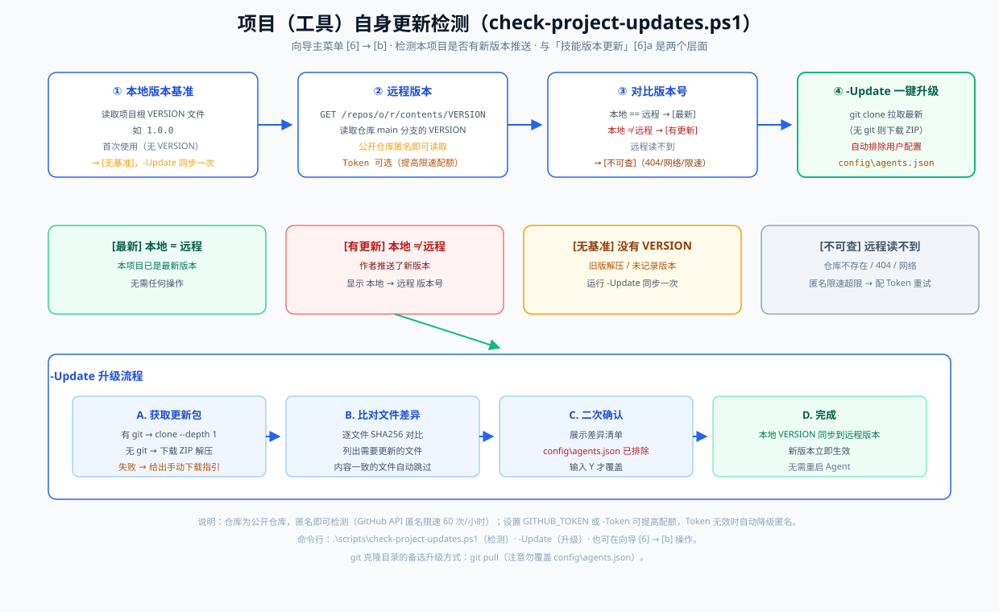

# Agent Skills 共享方案（统一目录 + 目录联接）

> **一个技能，只装一次，所有 Agent 共用。**
>
> 用 Windows 目录联接（NTFS Junction）把每个 Agent 的技能根目录指向同一个共享技能库，
> 解决「N 个 Agent × M 个技能 = N×M 次安装」的重复劳动问题。



## 功能总览

| 能力 | 说明 | 入口 |
| --- | --- | --- |
| 🗂️ **共享技能库** | 一套技能存一处，所有 Agent 通过目录联接实时共用；新增/更新/删除一处生效 | 自动（[1] 快速搭建） |
| 🖥️ **专业终端控制台** | VT 真彩色渐变标题、双线框面板、状态栏、语义色；不支持 ANSI 自动降级 16 色 | 桌面快捷方式 / `setup-wizard.ps1` |
| 🚀 **一键快速搭建** | 预设常见 Agent 路径（24 个，含 Marvis 动态发现）、自动探测本机已装、`d` 全选；迁移去重 → 建联接 → 验证 全自动 | 向导 [1] |
| 🧭 **技能管理** | 技能按 **9 大分类**自动归类；中文简介；GitHub / skills.sh 仓库链接一键安装；移除双重确认；分类浏览 | 向导 [3] |
| 🔍 **扫描 Agent 技能** | 随时检测各 Agent 已安装技能，标注「已共享 / 冲突 / 独有」并给出迁移建议 | 向导 [5] |
| 🧹 **多技能根归并** | 同一软件（豆包 / Trae 等）注册多个技能根导致技能重复加载时，一键归并到单个根，彻底消除重复 | 向导 [4]c / `merge-agent-roots.ps1` |
| 🔄 **检测更新** | 技能版本更新（对比来源仓库最新提交，可自动升级）+ 项目（工具）自身更新（一键升级） | 向导 [6] |
| 📌 **桌面快捷方式** | 首次启动自动创建「统一技能库管理」，双击即开控制台 | 自动 |

## 痛点

同时使用多个 Agent 软件（Doubao、Claude Code、Codex、Cursor、Windsurf、OpenClaw……）时，
每个 Agent 都从各自的固定目录加载技能：

| Agent | 技能根目录（用户级） |
| --- | --- |
| Doubao（豆包） | `%USERPROFILE%\AppData\Local\Doubao\User Data\Default\.doubao\agent_mode\workspace\.user_skills` |
| Claude Code | `%USERPROFILE%\.claude\skills\` |
| Codex / Cursor | `%USERPROFILE%\.agents\skills\` |
| Cursor | `%USERPROFILE%\.cursor\skills\` |
| OpenClaw | `%USERPROFILE%\.openclaw\workspace\skills\` |

装一个技能就要复制到每个目录；更新一个技能就要逐个覆盖。重复、易漏、版本漂移。

## 方案核心

1. **一个共享技能库**（唯一数据源）：`C:\Users\<you>\skills\shared`
2. **每个 Agent 的技能根目录 → 目录联接（Junction）指向共享库**
3. 读写穿透、实时共享：在共享库新增/更新/删除一个技能，**所有 Agent 的新会话同时生效**

### 为什么用 Junction 而不是复制 / 符号链接

| 方式 | 一次安装处处生效 | 需管理员权限 | 改动即时同步 | 跨卷 | 风险 |
| --- | :-: | :-: | :-: | :-: | --- |
| 复制到各目录 | ❌ | ❌ | ❌ | ✅ | 版本漂移 |
| 符号链接 `mklink /D` | ✅ | ✅（或开开发者模式） | ✅ | ✅ | 权限门槛高 |
| **目录联接 `mklink /J`（本方案）** | ✅ | ❌ | ✅ | ✅ | 删除语义需注意（见下文） |

## 快速上手（从 GitHub 到运行，约 3 分钟）

**第 1 步 · 获取项目（二选一）**

```text
方式一（无需安装 git）：
  仓库首页 → 绿色 Code 按钮 → Download ZIP → 解压到任意目录（如 C:\agent-skills-shared）
  ⚠ 解压后进入解压出来的文件夹（ZIP 解压后目录名通常是 agent-skills-shared-main）

方式二（推荐，以后更新方便）：
  git clone https://github.com/JacksenHu/agent-skills-shared.git
```

**第 2 步 · 打开 PowerShell 并放行脚本（仅首次需要）**

按 `Win + X` → 选择 **Windows PowerShell**（或 Windows 终端），执行：

```powershell
Set-ExecutionPolicy -ExecutionPolicy RemoteSigned -Scope CurrentUser
```

> 只影响当前用户，让系统允许运行本地下载的 `.ps1` 脚本。输入 `Y` 确认即可。
> 如果之前已允许过，可跳过此步。

**第 3 步 · 进入项目目录并启动交互式控制台**

```powershell
cd C:\agent-skills-shared        # 换成你实际解压/克隆的目录
.\scripts\setup-wizard.ps1
```

看到下面的界面就说明项目已跑起来：

```text
╔══════════════════════════════════════════════════════════╗
║                 统一技能库 · 管理控制台                    ║
║           一套技能 · 只装一次 · 所有 Agent 共用            ║
╠─ 主菜单 ──────────────────────────────────────────────────╣
║  [1] 快速搭建    [2] 验证联接    [3] 技能管理              ║
║  [4] 接入/移除   [5] 扫描已装    [6] 检查更新              ║
║  [7] 帮助与文档  [0] 退出                                  ║
╠─ 状态 ────────────────────────────────────────────────────╣
║  共享库 …\skills\shared  ·  59 个技能  ·  5 个 Agent       ║
╚══════════════════════════════════════════════════════════╝
```

**第 4 步 · 按菜单搭建**

输入 `1` 进入快速搭建：确认共享库位置（默认 `C:\Users\<你>\skills\shared`）→
勾选要接入的 Agent（脚本会自动探测本机已装的，输入 `d` 一键全选）→ 确认后自动完成
**迁移已有技能 → 建立联接 → 验证**。最后重启各 Agent 会话，技能即全部生效。

**首次启动自动创建桌面快捷方式**：第一次运行向导时，桌面会自动出现
「统一技能库管理」快捷方式，以后**双击它即可打开管理控制台**（等同运行向导），
不需要可自行删除。若移动/删除了项目文件夹导致快捷方式失效，删掉旧快捷方式、
再启动一次向导即可自动重建。

> 💡 之后每次使用，双击桌面「统一技能库管理」，或运行 `.\scripts\setup-wizard.ps1`：
> 加装技能选 [3]b、查看分类选 [3]a / [3]d、扫描各 Agent 已装技能选 [5]、
> 技能升级选 [6]a、项目（工具）升级选 [6]b。
> 更新项目：git clone 方式 `git pull`；ZIP 方式重新下载解压（**别覆盖**你生成的 `config\agents.json`），
> 或在向导 [6]b 用 `-Update` 一键升级。



## 使用项目（日常操作）

**方式 A（推荐）· 交互式控制台，全程只需选择**（首次启动后，双击桌面
「统一技能库管理」即可进入，或手动运行下面命令）：

```powershell
.\scripts\setup-wizard.ps1
```

打开**首页主菜单**：

| 菜单 | 功能 |
| --- | --- |
| [1] 快速搭建 | 配置 Agent 路径 → 迁移已有技能（**内容一致自动去重、内容不同提示冲突**）→ 建立联接 → 验证，无需手写 JSON |
| [2] 验证联接 | 逐项检查每个 Agent 的目录、Junction 指向、技能可见数 |
| [3] 技能管理 | **a** 技能清单（按 9 大分类分组，含中文简介）· **b** 从 GitHub / skills.sh 仓库链接安装 · **c** 移除（双重确认）· **d** 按分类浏览 |
| [4] 接入 / 移除 Agent | 单 Agent 接入（含去重/冲突处理）、移除（回滚）、**归并多技能根**（消除重复加载） |
| [5] 扫描已装技能 | 发现各 Agent 中未进共享库的技能，标注「已共享 / 冲突 / 独有」 |
| [6] 检查更新 | **a** 技能版本更新（对比来源仓库最新提交，可自动升级）· **b** 项目（工具）自身更新（一键升级） |
| [7] 帮助与文档 | docs 导航 + 常用命令速查 |
| [0] 退出 | 结束会话 |

搭建时**预设 24 个常见 Agent 技能路径**（Doubao、Claude Code、Codex、Cursor、Windsurf、
OpenClaw、Trae、Trae CN、GitHub Copilot、Zed、WorkBuddy（国内版）、CodeBuddy Code / WorkBuddy AI（国际版）、Marvis、Gemini CLI、OpenCode、Qoder、
Qoder CN、Kiro、Cline、Roo Code、Augment、Crush、Pi 等，均来自官方文档或实测），
自动探测本机哪些已安装 → 输入 `d` **一键全选已检测到的**，或按编号勾选 → 回车确认。
也支持**自定义路径**：直接输入任意 Agent 的技能根目录即可接入。

### 控制台界面特性

- **VT 真彩色渐变标题**：Windows 10+ 终端自动启用；不支持 ANSI 的环境自动降级为 16 色，功能完全一致
- **双线框面板**：所有菜单、清单、确认框统一 `╔╗║╠╣╚╝` 双线边框 + 标题栏
- **状态栏**：实时显示共享库路径、技能总数、已接入 Agent 数
- **语义色**：操作提示 / 成功 / 警告 / 错误 / 危险操作分色显示；危险删除带红框 + 双重确认

### 脚本对中文环境的兼容

全部脚本统一 **UTF-8 带 BOM** 编码，Windows PowerShell 5.1 直接运行中文不乱码
（早期无 BOM 版本在部分系统会乱码，已修复）。

**从仓库链接一键装技能（含在其他终端/脚本中）：**

```powershell
# GitHub 仓库
.\scripts\install-skill.ps1 -RepoUrl "https://github.com/owner/skill-repo"
# skills.sh 技能市场（Vercel，底层仍是 GitHub 仓库）
.\scripts\install-skill.ps1 -RepoUrl "https://skills.sh/s/owner/repo"
# 指定仓库里的某个技能
.\scripts\install-skill.ps1 -RepoUrl "https://skills.sh/s/owner/repo/skill-name"
```

安装后自动为每个技能生成**中文简介元数据**（`_meta.json`，技能管理列表会显示），
并记录**版本基准**（来源仓库 `branch` + 默认分支最新提交 `commitSha`），供检测升级使用。

**检测技能版本更新（对比 GitHub 仓库最新提交）：**

```powershell
# 只检测，列出「有更新 / 已最新 / 无基准 / 不可查」四类
.\scripts\check-updates.ps1
# 检测并自动升级所有有更新的仓库（逐个 install-skill.ps1 -Replace）
.\scripts\check-updates.ps1 -Update
# 或设置 GitHub Token（匿名 API 限速 60 次/小时）提高配额
.\scripts\check-updates.ps1 -Token ghp_xxx
```

也可在向导主菜单选 [6] → **a**。检测到更新后重启各 Agent 会话生效。
只有**从仓库链接安装**的技能可检测；迁移/手放的技能无远程依据，仅显示本地版本号。



**检测本项目（工具）自身更新（新版本推送）：**

```powershell
# 只检测：对比本地 VERSION 与 GitHub 仓库远程 VERSION（公开仓库，匿名即可）
.\scripts\check-project-updates.ps1
# 检测并一键升级（git clone 或下载 ZIP，自动排除 config\agents.json）
.\scripts\check-project-updates.ps1 -Update
# 可选：设置 GitHub Token 提高 API 配额（匿名限速 60 次/小时）
.\scripts\check-project-updates.ps1 -Token ghp_xxx
```

也可在向导主菜单选 [6] → **b**。升级完成后新版本立即生效（无需重启 Agent）。
Token 可选：GitHub → Settings → Developer settings → Personal access tokens →
Generate new token (classic)；也可设置环境变量 `GITHUB_TOKEN` 自动使用，
Token 无效时脚本会自动降级为匿名访问。



**随时检测各 Agent 已安装技能（发现未进共享库的技能）：**

```powershell
.\scripts\scan-agents.ps1
```

或在向导主菜单选 [5]。用户在各 Agent 里手动安装的技能会落在该 Agent 自己的目录，
扫描会标注「已共享 / 冲突 / 独有」并给出迁移建议。

**方式 B · 手动配置：**

```powershell
# 1. 复制配置模板并填写你的 Agent 路径
copy config\agents.example.json config\agents.json
notepad config\agents.json

# 2. 试运行（只看会做什么，不真正执行）
.\scripts\setup.ps1 -WhatIf

# 3. 正式执行
.\scripts\setup.ps1

# 4. 验证所有 Agent 的技能可见性
.\scripts\verify.ps1

# 5. 重启各 Agent 会话，技能生效
```

> ⚠️ 脚本会自动把各 Agent 目录里**已有的技能迁移**进共享库（同名冲突会保留原文件并生成报告，不会覆盖）。
> 脚本只处理你写入 `agents.json` 的路径，**不会**触碰 Doubao 的 `.skills` 系统技能目录。

## 目录结构

```
agent-skills-shared/
├── README.md                      # 本文件（总览）
├── VERSION                        # 项目版本号（供 check-project-updates.ps1 对比远程）
├── docs/
│   ├── 01-architecture.md         # 方案详解：机制、原理、对比
│   ├── 02-agent-path-reference.md # 各 Agent 技能目录速查表（带官方来源）
│   ├── 03-setup-guide.md          # 完整搭建指南（迁移/验证/生效）
│   ├── 04-day-to-day.md           # 日常使用：新增/更新/删除技能、增删 Agent
│   ├── 05-safety-and-rollback.md  # 风险清单与回滚流程
│   └── 06-faq.md                  # 常见问题
├── diagrams/                      # 图解（SVG，GitHub 可直接渲染）
│   ├── architecture.svg           # 整体架构图
│   ├── junction-mechanism.svg     # Junction 机制原理图
│   ├── setup-flow.svg             # 搭建流程
│   ├── update-flow.svg            # 日常更新流程
│   ├── rollback-flow.svg          # 回滚流程
│   ├── skills-management.svg      # 技能管理（分类/仓库安装/移除/浏览/扫描）
│   ├── check-updates-flow.svg     # 技能版本更新检测流程
│   ├── check-project-updates-flow.svg # 项目（工具）自身更新检测流程
│   └── quickstart-flow.svg        # 快速使用流程（含桌面快捷方式）
├── config/
│   └── agents.example.json        # Agent 路径配置模板（含 24 项预设）
└── scripts/
    ├── setup-wizard.ps1            # 交互式控制台：首页菜单（搭建/验证/技能管理/扫描/检查更新）
    ├── setup.ps1                   # 一键搭建：迁移（智能去重）+ 建联接 + 验证
    ├── install-skill.ps1           # 从 GitHub / skills.sh 仓库链接一键安装技能（自动生成中文简介+版本基准）
    ├── check-updates.ps1           # 检测技能版本更新（对比 GitHub 仓库最新提交，-Update 自动升级）
    ├── check-project-updates.ps1   # 检测本项目（工具）自身更新（对比 VERSION，-Update 一键升级）
    ├── scan-agents.ps1             # 扫描各 Agent 已安装技能（发现未进共享库的技能）
    ├── add-agent.ps1               # 为单个 Agent 建立联接（含去重/冲突处理）
    ├── remove-agent.ps1            # 移除单个 Agent 的联接（回滚）
    ├── merge-agent-roots.ps1       # 归并「同一 Agent 多技能根」：只保留一个根接入共享库，其余拆空（消除重复加载）
    ├── verify.ps1                  # 验证所有联接与技能可见性（归并根显示 [归并·空]）
    └── lib\
        └── duplicate-guard.ps1     # 「同一 Agent 多技能根」重复加载防护（setup/add-agent/verify/merge 共用）
```

## 文档导航

- 想理解原理 → [`docs/01-architecture.md`](docs/01-architecture.md)（含机制图解）
- 想核对你的 Agent 路径 → [`docs/02-agent-path-reference.md`](docs/02-agent-path-reference.md)
- 想完整搭建 → [`docs/03-setup-guide.md`](docs/03-setup-guide.md)
- 想日常维护 → [`docs/04-day-to-day.md`](docs/04-day-to-day.md)
- 想了解风险 → [`docs/05-safety-and-rollback.md`](docs/05-safety-and-rollback.md)
- 有问题先看 → [`docs/06-faq.md`](docs/06-faq.md)

## 图解导航

| 图解 | 内容 |
| --- | --- |
| [`diagrams/architecture.svg`](diagrams/architecture.svg) | 整体架构：一个共享库 ↔ 多个 Agent 联接 |
| [`diagrams/junction-mechanism.svg`](diagrams/junction-mechanism.svg) | Junction 机制原理 |
| [`diagrams/setup-flow.svg`](diagrams/setup-flow.svg) | 搭建流程 |
| [`diagrams/update-flow.svg`](diagrams/update-flow.svg) | 日常使用流程 |
| [`diagrams/skills-management.svg`](diagrams/skills-management.svg) | 技能管理（分类/仓库安装/移除/浏览/扫描） |
| [`diagrams/check-updates-flow.svg`](diagrams/check-updates-flow.svg) | 技能版本更新检测流程 |
| [`diagrams/check-project-updates-flow.svg`](diagrams/check-project-updates-flow.svg) | 项目（工具）自身更新检测流程 |
| [`diagrams/quickstart-flow.svg`](diagrams/quickstart-flow.svg) | 快速使用流程（获取项目 → 放行 → 首次启动建快捷方式 → 日常菜单） |
| [`diagrams/rollback-flow.svg`](diagrams/rollback-flow.svg) | 回滚流程 |

## 环境要求

- Windows 10 / 11（NTFS 分区）
- PowerShell 5.1+（Windows 自带）
- **不需要管理员权限**（Junction 无需提权）
- 可选依赖：`git`（项目自身更新检测 -Update 时优先使用，未安装则自动改用下载 ZIP）；`GitHub Token`（可选，用于提高 GitHub API 配额，匿名限速 60 次/小时）

## 已知边界

- **内容共享 ≠ 行为通用**：Agent 平台专属语法（Claude Code 的斜杠命令、OpenClaw 的插件配置等）不会跨平台生效，共享的是通用 Prompt 型技能。
- **共享命运**：在一个 Agent 里删改技能会影响所有 Agent——这是特性，也是风险（见风险文档）。
- **索引时机**：绝大多数 Agent 在会话启动时扫描技能，改动后需重启会话。
- **API 配额**：技能更新检测（`check-updates.ps1`）与项目更新检测（`check-project-updates.ps1`）匿名访问 GitHub API 限速 60 次/小时，多技能/频繁检测时可设置 Token 提高配额。
- **同一 Agent 多技能根 → 技能重复显示**：部分软件（如豆包、Trae）会同时扫描多个技能根，若这些根全部接入共享库，每个技能会被重复加载多份（豆包读 `.user_skills` / `Doubao\skills` / `.agents\skills` → 每技能 3 份）。脚本已内置「同源多根」防护：`setup.ps1` / `add-agent.ps1` 接入前自动检测并默认阻止，`verify.ps1` 会提示；**一键根治**：运行 `.\scripts\merge-agent-roots.ps1`（或向导 [4]c）把每个软件归并到单个技能根（其余根拆联接变空目录，技能数据不丢），重复立即消失。
- **Agent 技能根非固定目录**：个别软件（如腾讯 Marvis）的技能根含登录用户 ID（`%APPDATA%\Tencent\Marvis\User\<用户ID>\skills\custom`），重装/换账号可能变化。向导已对 Marvis 做**动态发现**（自动扫描 `User\` 下含技能的用户目录），无需手写路径；`agents.example.json` 中该条目为占位说明。
- 本项目面向 Windows；macOS / Linux 用户可用符号链接（`ln -s`）实现同一思路。

## License

[MIT](LICENSE)
